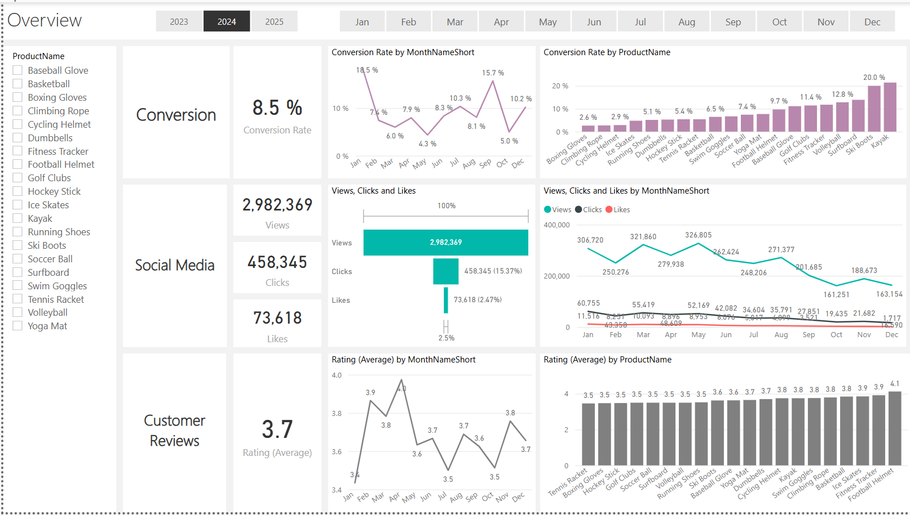
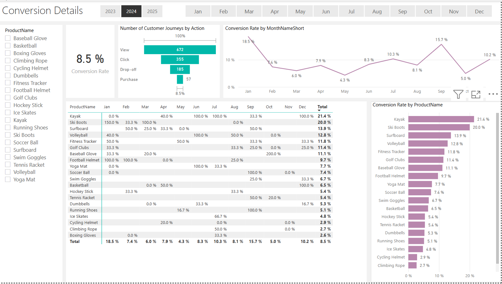
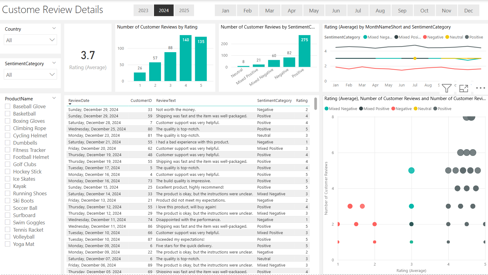

# 🧾 Market Sales Analysis Dashboard (Power BI)

This project presents an in-depth **Market Sales Analysis** using **Power BI**, focusing on key metrics such as conversion rates, social media performance, and customer reviews. Through interactive dashboards and detailed breakdowns, the project uncovers valuable insights to improve product performance, customer engagement, and marketing strategies.

## 📌 Project Objective

The main objective of this project is to:

* Analyze sales performance across multiple sports and fitness products.
* Track customer journey stages: Views → Clicks → Purchases. 
* Understand customer sentiment and review trends.
* Evaluate conversion rates per product and time.
* Leverage social media metrics to enhance product reach.

---

## 📊 Dashboards Overview

### 1. **Overview Dashboard**

* **Conversion Rate**: 8.5% average for the year 2024.
* **Social Media Stats**:

  * Views: 2,982,369
  * Clicks: 458,345
  * Likes: 73,618
* **Customer Rating**: 3.7 out of 5 average.
* Visuals:

  * Monthly conversion rate trends.
  * Product-wise conversion performance.
  * Social media views, clicks, and likes trends.

---

### 2. **Conversion Details**

* Funnel showing drop-off from View → Click → Purchase.
* Conversion rate breakdown per product and month.
* Products with highest conversion:

  * **Kayak**: 21.4%
  * **Ski Boots**: 20.0%
* Insights:

  * Helps identify high-performing products and timeframes.

---

### 3. **Social Media Details**

* Detailed monthly breakdown of views by:

  * Product
  * Content type (Blog, Social Media, Video)
* Visual analysis to correlate social engagement with product interest.
* Highest viewed products:

  * **Ice Skates**: 193,992 views
  * **Cycling Helmet**: 182,404 views

---

### 4. **Customer Review Details**

* Breakdown of reviews by rating and sentiment:

  * Positive: 275 reviews
  * Average rating: 3.7
* Sentiment insights:

  * Majority reviews are positive.
  * Negative reviews highlight quality and delivery issues.
* Sentiment vs. Rating visual to evaluate customer satisfaction trends.
  

---

## 🔍 Key Insights

* **Kayak** and **Ski Boots** have the highest conversion rates.
* **Ice Skates** and **Cycling Helmets** perform well in terms of social media engagement.
* Positive sentiment dominates customer feedback but opportunities for improvement exist in negative-rated products.
* Monthly dips and spikes in conversion highlight the need for strategic marketing during low months (e.g., May, November).

---

## 📁 Files Included

* `Sales Analysis.pbix` – Power BI report file with all dashboards.
* PNG Screenshots – Visuals for each section of the report.
---

## 🛠 Tools Used

* **Power BI** for data visualization
* **DAX** for calculated measures and KPI tracking
* **Data Modeling** for integrating sales, reviews, and social metrics

---

## 📈 Potential Use Cases

* Retail or ecommerce platforms to monitor product performance.
* Marketing teams for planning promotional content and timing.
* Product teams for identifying customer satisfaction drivers.

